I’m back again, but not like some random tech junkie - I’m back as a physics student. So in this post let’s kill some stars rather than falling on some random technology.

## Introduction

We’ve learned in pre school or college about what happened for the first billion years or so in the history of the universe, which leaves us with lots of stars and galaxies, and we are now equipped with the terminology needed to describe and categorize these stars.

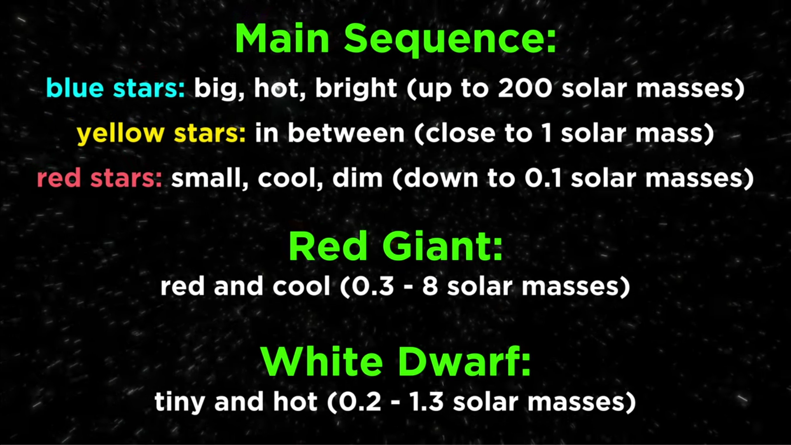

But hold on, we still haven’t talked about all the other elements on the periodic table, we’ve only know about  Hydrogen (H) and Helium (He) so far, we got these from **Big Bang Nucleosythesis.** 

* So where did the rest come from?
* And what about all the planets and moons?
* How did those get here?

The answer to all of these questions will make sense once we learn more about what goes on inside a star, from the moment they are born, to the time of their death. That’s right, stars actually die, so to speak, and the type of death, along with what’s left over, will be one of a variety of possibilities, depending entirely on the mass of the star. 

So let’s go through the lifetime of a few different kinds of stars, so that we are ready to understand the next 13 billion years of development in the universe. The life cycle of any star, from birth to death, and all the stages in between, will span millions or even billions of years. This is why stars don’t seem to change at all, because a human lifetime is a snippet of a fraction of a blink of an eye to these behemoths.

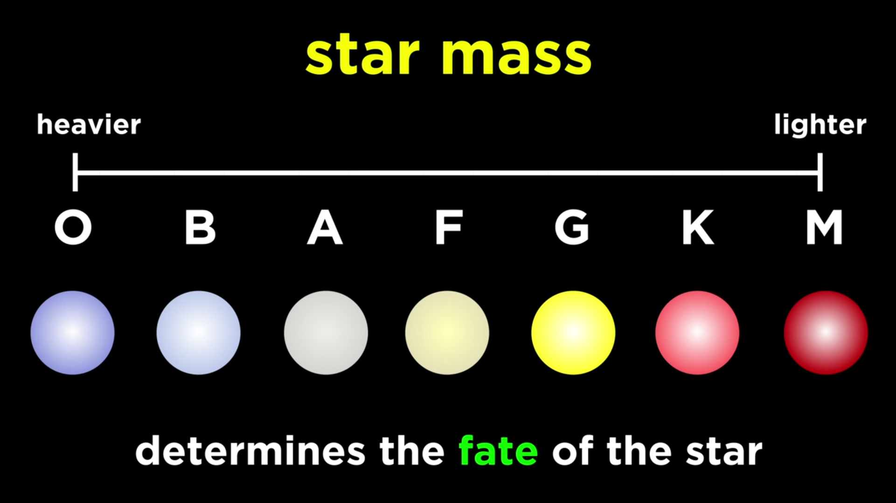

The path that will be followed by a particular star depends mainly on its mass, or how much gas collected and collapsed to form the star, because that material will serve as the star’s fuel. As we may remember from physics and chemistry, when nuclei collide with enough energy so as to overcome the electromagnetic repulsion between them, the strong nuclear force takes over, and they fuse, with a small fraction of their mass converting into huge amounts of pure energy, as dictated by **E equals MC squared.**

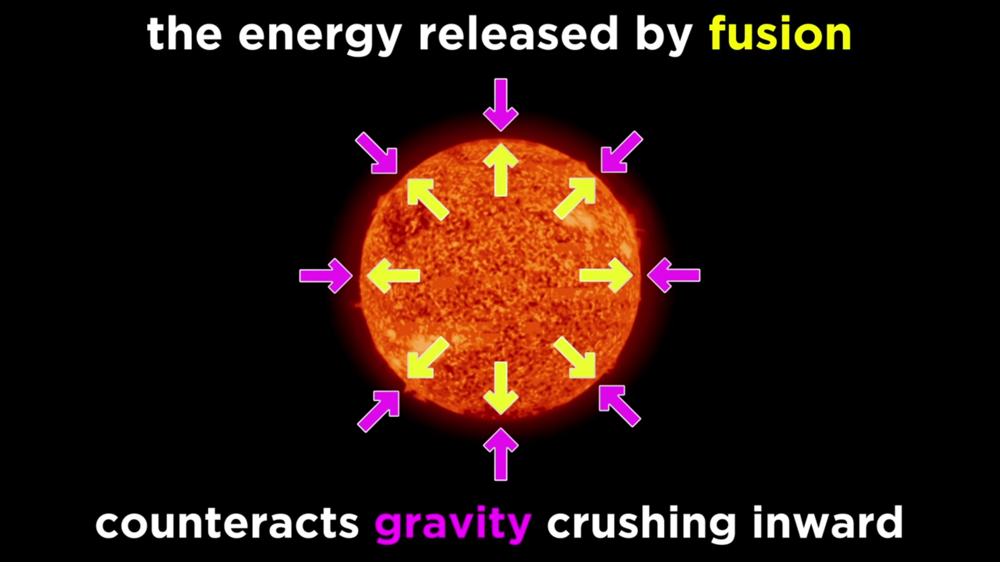

Therefore, only by colliding nuclei together and fusing them in its ultra-hot core can a star release enough outward energy to counter the effects of gravity relentlessly crushing inward. This means that the amount of matter that forms the star determines the amount of fuel, and through a variety of other factors, the lifetime and eventual fate of the star. Given that mass is the key factor here, let’s start with a low-mass star.

## Low Mass Star

This would range from the smallest that stars can be, meaning the smallest amount of material that can sufficiently trigger nuclear fusion so as to qualify as a star, which is about thirteen Jupiter masses, to a star somewhere in the ballpark of our sun’s mass.

### Main Sequence Star

As we already know, any star will begin as a cloud of gas and dust at least a few light years across. In the earliest era of star formation, this material was almost exclusively hydrogen and helium, as this was what remained after the brief seventeen minutes of nucleosynthesis soon after the Big Bang. This matter collects due to gravity, pushing increasingly inward as it contracts, until things get so hot over a few million years that nuclear fusion eventually begins, establishing an equilibrium, and generating a **yellow or red main sequence star** that glows with all the energy released from the collisions happening inside.

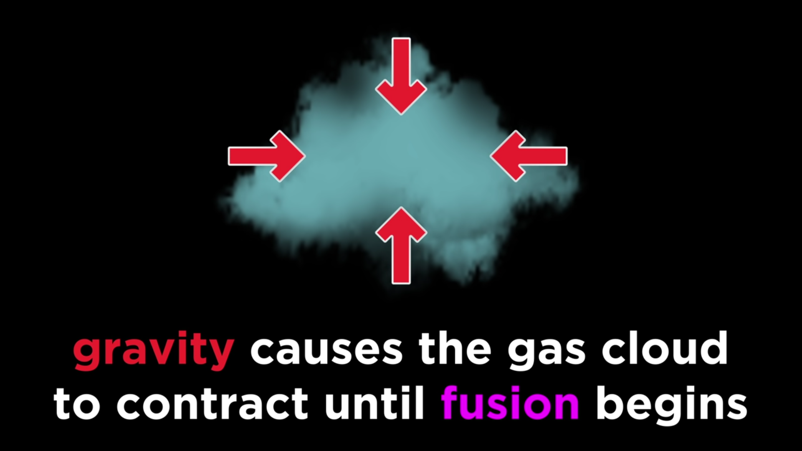

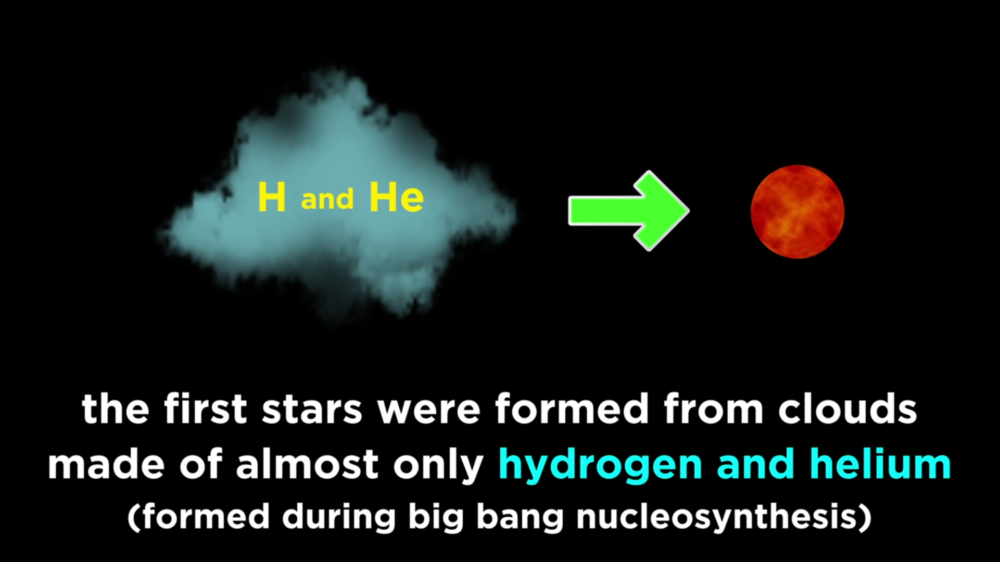

> These fusion reactions begin with **two protons fusing**, followed by subsequent **beta decay**, to get a proton and a neutron, and we call this a Deuteron, which is a nucleus of heavy hydrogen. **Then Deuterons are involved in reactions that make Helium**, which has two protons and two neutrons. 

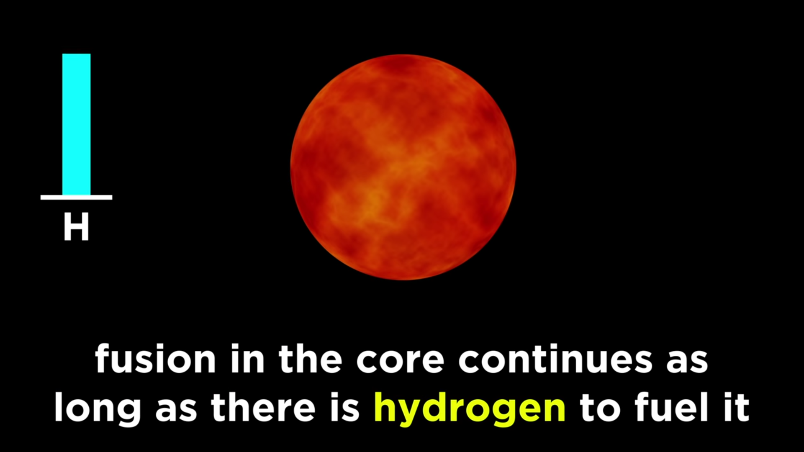

Such a star will continue in this manner for billions of years, slowly fusing all of the hydrogen in its core into helium, and maintaining a relatively steady size, temperature, and luminosity as it does so, until almost all of the hydrogen is gone.

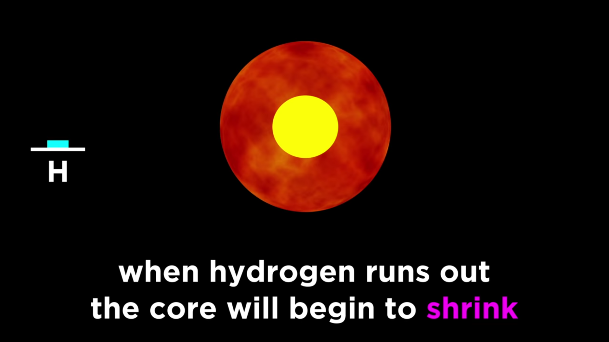

### Red Giant

At this point, things really begin to change. The core of the star will shrink and get hotter, which makes the remaining hydrogen burn even faster, and all of that extra energy being generated will radiate outwards and push the outer layers away from the core. As the outer layers expand, they cool, and thus become more and more red, and the **star climbs up the red giant branch until we have a red giant star.**

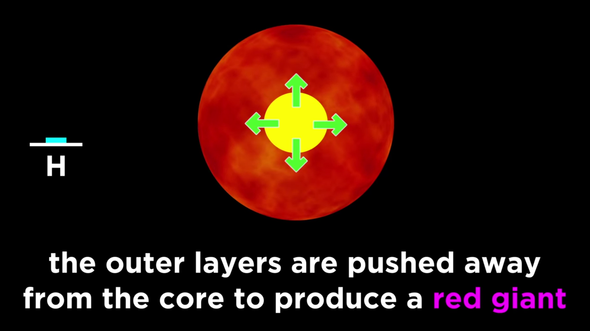

### Helium Flash

The star can maintain this new status for a little while longer, around a billion years, but after almost all the hydrogen is gone, the core gets even smaller and even hotter. At this stage, a phase called **helium flash**, things are so hot that the **star is able to fuse these heavier Helium nuclei into larger nuclei like Carbon**, **and then oxygen**, through something called the **triple-alpha process**, and this means that the star has a whole new source of fuel in all the helium it has been making for billions of years.

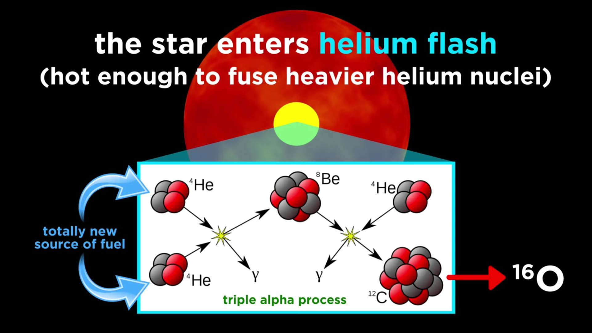

### Horizontal Branch

**The star begins pulsating** as it runs through its final energy reserve, entering what we call the **horizontal branch**, and in this time it becomes smaller, hotter, and bluer, until at last much of the helium has been fused into larger nuclei.

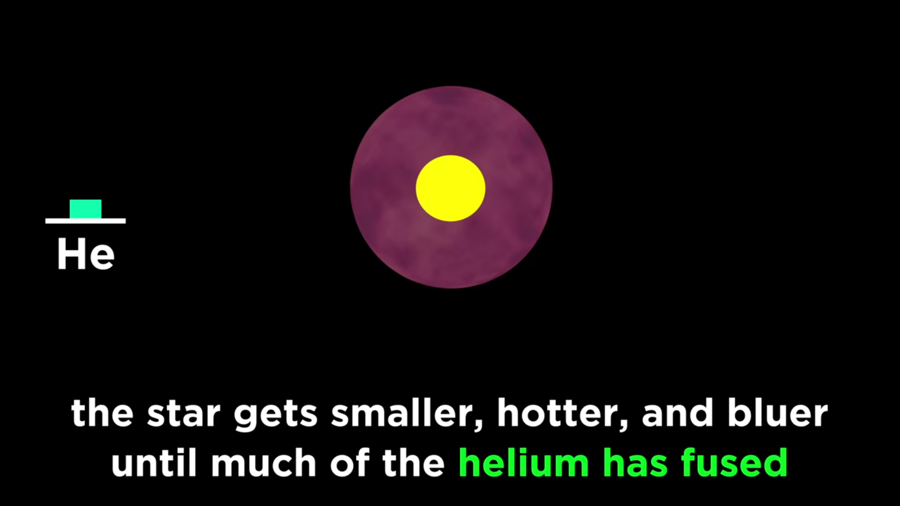

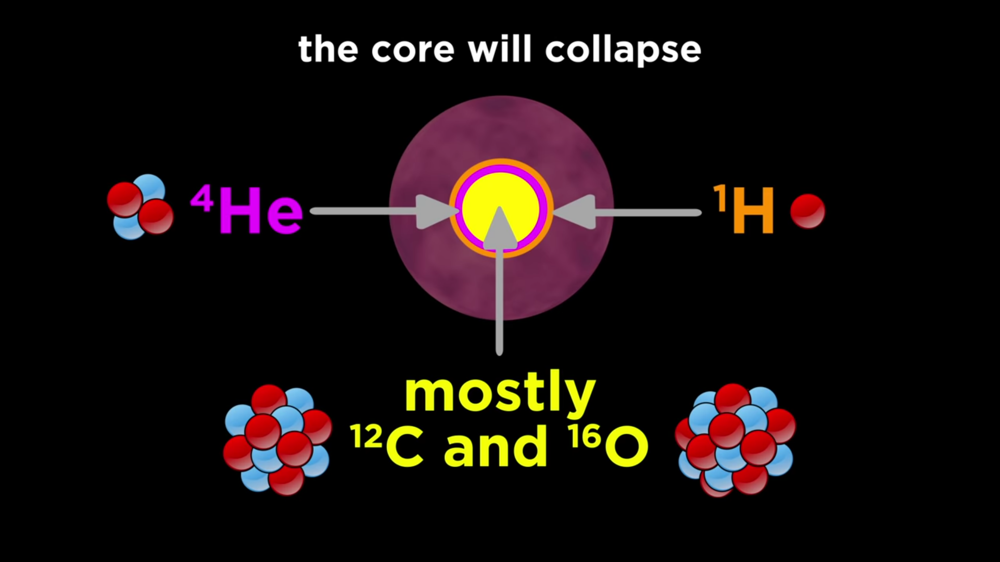

### Asymptotic Branch

Once the core is predominately carbon and oxygen, with just a shell of helium around it, and a shell of hydrogen around that, the star has very little material left to burn, so the core will collapse and the star enters the asymptotic giant branch. This means it will grow rapidly and become a giant star again, until the last bursts of energy eject the outer layer, pushing it away from the core and back into the interstellar medium, leaving only a tiny, very hot, bare core behind, about the size of Earth. This will gradually cool, as it has no more fuel to burn, not being hot enough to fuse carbon or oxygen nuclei, and it will contract further until we are left with a white dwarf star.

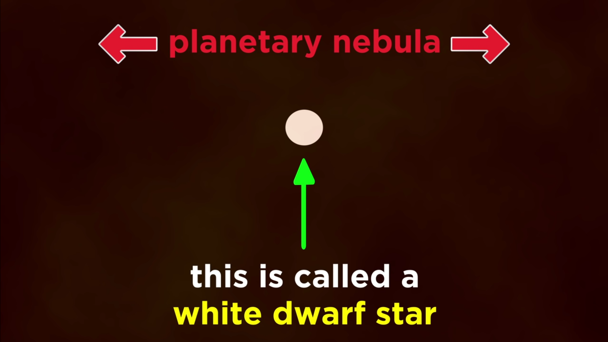

### Planetary Nebula

The ejected shell is called a **planetary nebula** and the material in a planetary nebula will then become available to join more gas particles to form yet another star.

> which is misleading, since it is not a planet and did not come from a planet, but the name originated from confusion upon its discovery, and it stuck.

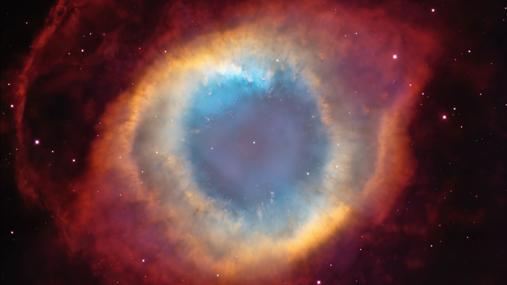

### White Dwarf

Lower-mass stars that begin with less than about eight solar masses leave behind white dwarfs, because once reduced to its lighter earth-sized core, there is not enough gravity to overcome electron degeneracy pressure

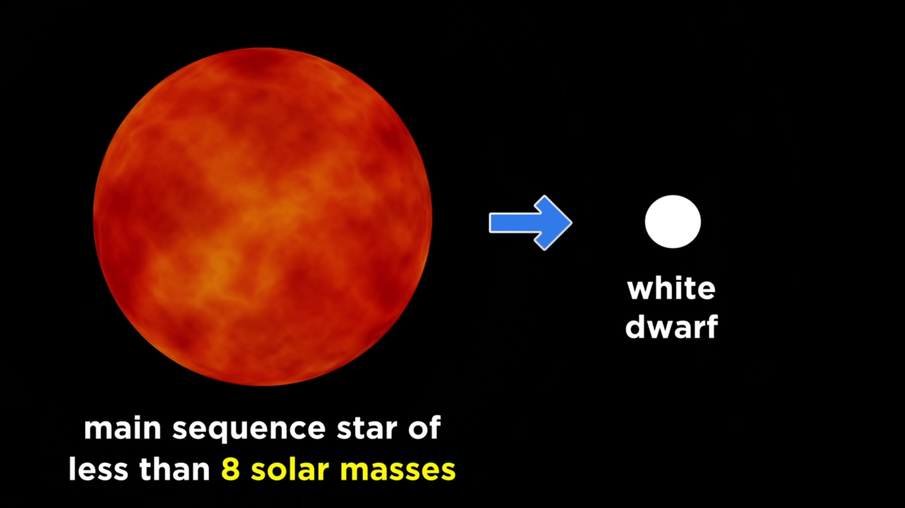

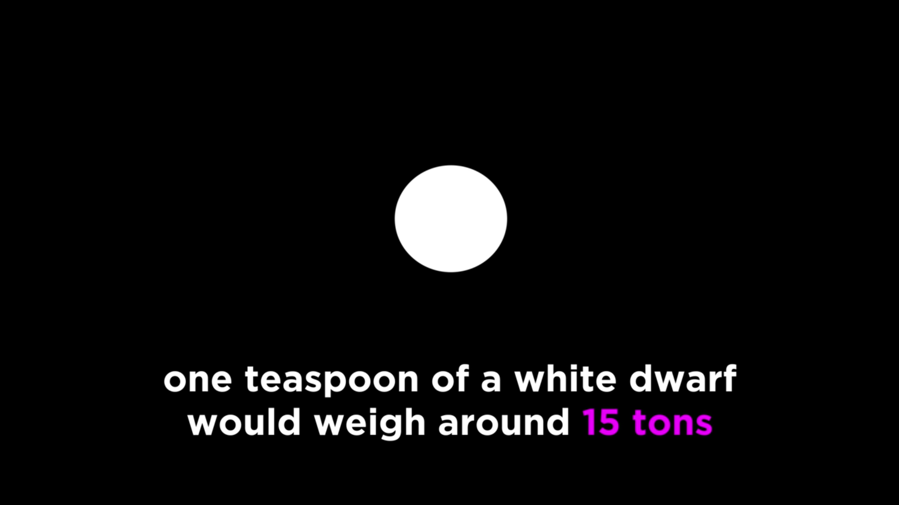

In other words, a white dwarf will become kind of like one gigantic metallic solid, with the electron clouds around the nuclei pushing against each other and preventing further collapse. Even still, this object is very dense, with one teaspoon weighing around fifteen tons.

So below around 1.4 solar masses, the maximum mass of a white dwarf, which is also known as the Chandrasekhar limit, this is the fate of the core of a star.

## High Mass Star

Now for a high-mass star, ones much more massive than our sun, things are quite different. Their demise will not be so quiet. **Big stars go out with a bang**. Things start out normally, with a gas cloud collecting under the influence of gravity. It is simply that this cloud will be much larger than those that form low-mass stars, so it will contain much more mass. **More mass means more gravity, which means the force pushing inward is much stronger, and the star gets much hotter.** 

### Main Sequnce Star

A hotter temperature means faster fusion, which generates greater outward pressure to counteract the greater inward pull of gravity. This will result in a main-sequence star that is hot, big, bright, and blue. This is where things start to go differently from low-mass stars.

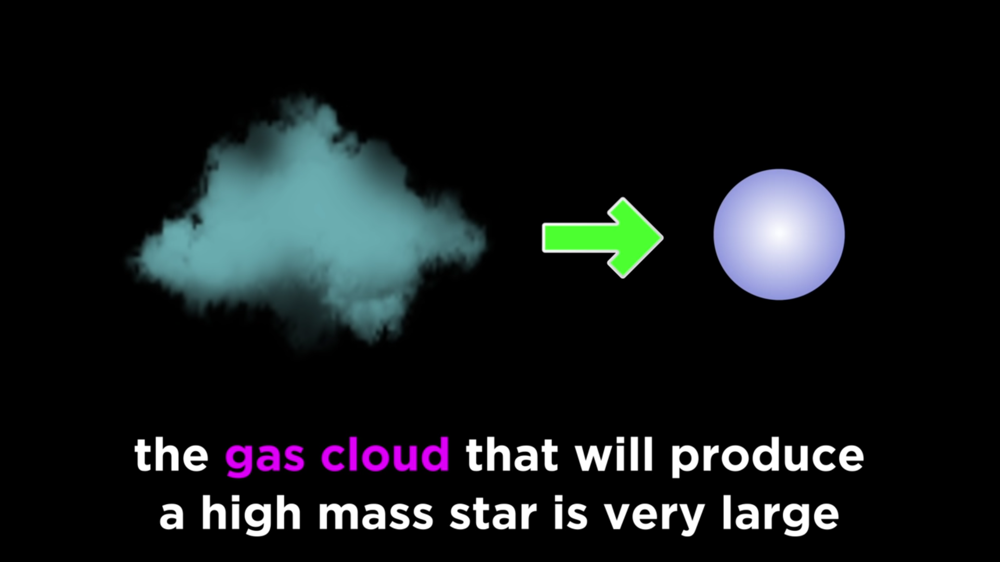

### Giant Star

Whereas low-mass stars take billions of years to use up all their fuel, **high-mass stars are much hotter and burn their fuel much faster.** That means they use up all the hydrogen in their cores in around just a fleeting hundred million years, or even ten million if big enough. As the fuel starts running out, the core contracts and heats, producing more energy, so the star will swell up into a giant star, just like we saw for low-mass stars. 

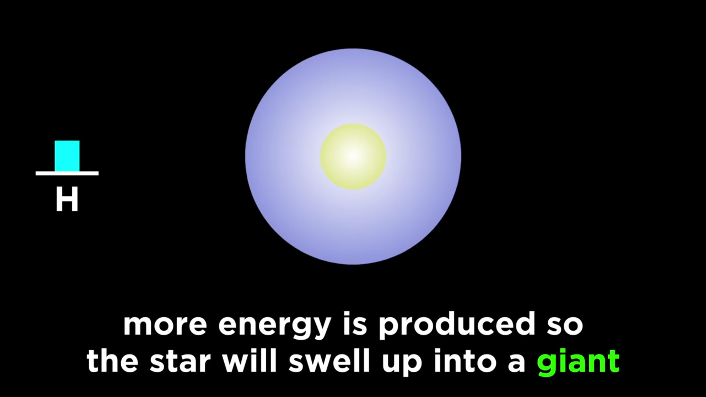

### Iron Core

But while the core of a high-mass star continues to compress, it gets much hotter than the core of a low-mass star, and it becomes able to fuse helium nuclei to form carbon, and then oxygen, and then neon, and then silicon, each heavier nucleus being relegated to a smaller and smaller region of the core that is hot enough to fuse it All the way at the center sits the heaviest element that can be fused within a star, iron.

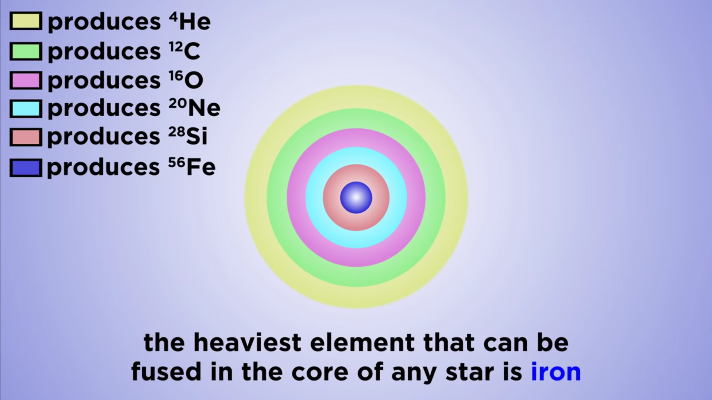

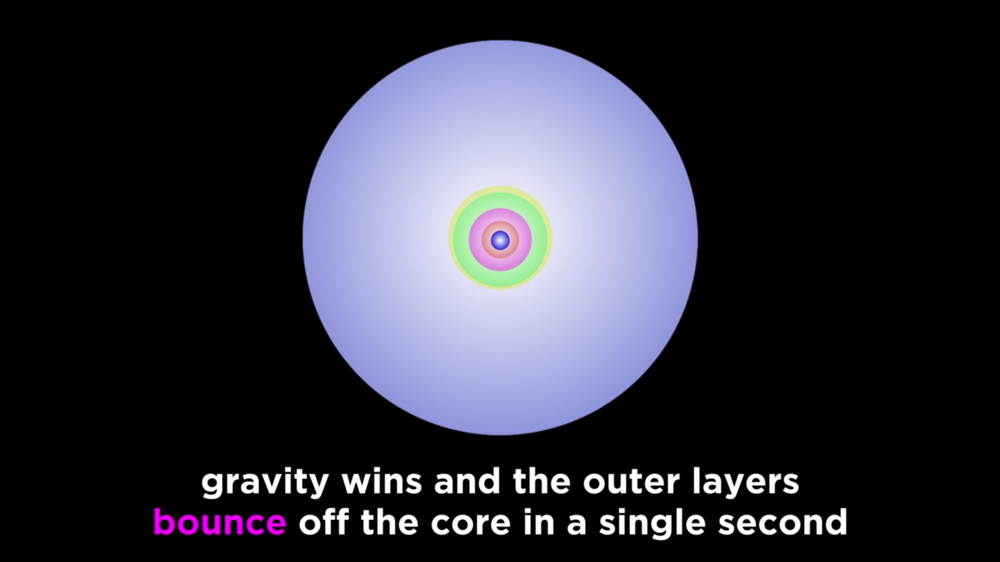

### Supernova

As this occurs in these different layers, each performing a particular type of fusion until no fuel remains, the star is left with a core of iron nuclei that are so stable that further fusion can release no more energy. **At this point, gravity wins the fight, and the star collapses within a single second, the outer layers bouncing off the core and triggering an explosion, thus ejecting all of the heavy nuclei the star has created, out into space.** This awesome event, one of the most violent and energetic phenomena in the universe, is called a **supernova**.

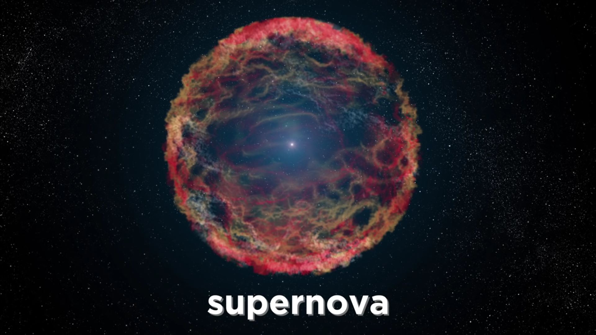

A supernova generates such an unbelievable burst of energy that in this brief moment, dozens of elements heavier than iron can also be synthesized. Nickel, copper, zinc, silver, gold, any element with an atomic number greater than twenty-six, is made either in a supernova, or a rare event like the collision of two neutron stars, or a neutron star and a black hole, which are objects we will discuss in a moment. That’s why these heavy elements are so rare compared to elements like carbon and oxygen, because stars can’t synthesize them the way they can synthesize all the elements up to iron throughout their long lives.

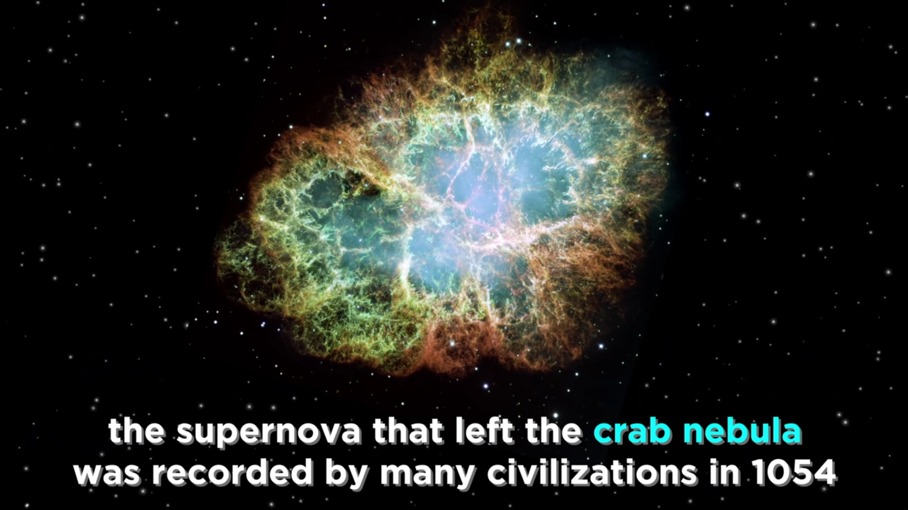

Nature only makes these rare elements during the death of a high-mass star, or in certain exotic collision events. Supernovae are also so bright that they are brighter than the entire galaxy they belong to when viewed through telescopes, and if in our own galaxy, they can even be visible with the naked eye, like the one that generated the famous Crab Nebula, which was recorded by a variety of civilizations in 1054.

### Neuron Star

Now, a supernova does not leave behind a white dwarf. Lower-mass stars that begin with less than about eight solar masses leave behind white dwarfs, because once reduced to its lighter earth-sized core, there is not enough gravity to overcome electron degeneracy pressure.

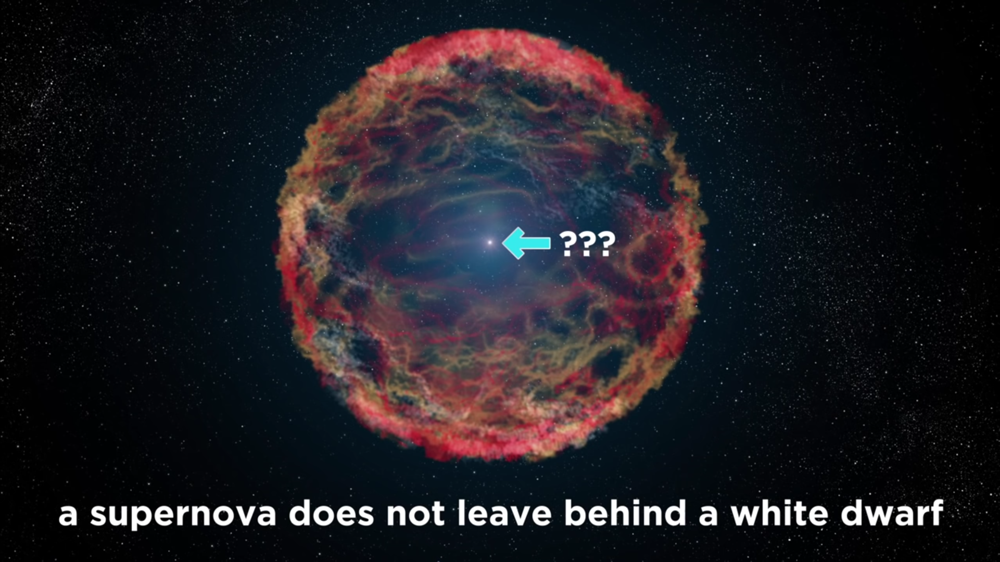

In other words, a white dwarf will become kind of like one gigantic metallic solid, with the electron clouds around the nuclei pushing against each other and preventing further collapse. Even still, this object is very dense, with one teaspoon weighing around fifteen tons.

So below around 1.4 solar masses, the maximum mass of a white dwarf, which is also known as the Chandrasekhar limit, this is the fate of the core of a star.

But for a high-mass star, where upon its death the core of the star is above the Chandrasekhar limit, which means it is massive enough for a supernova to occur, one of two things will be left behind.

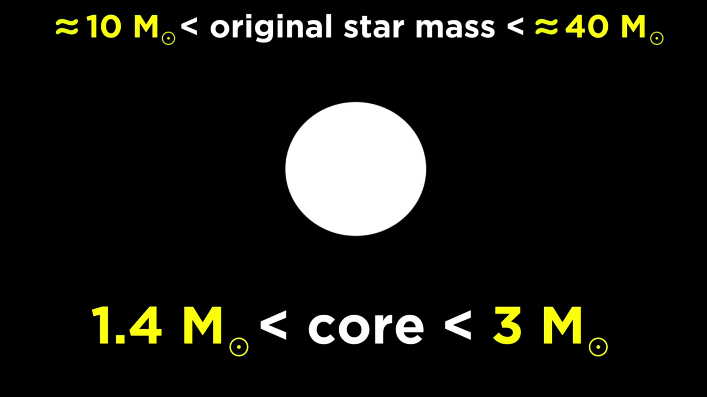

If the core is between around 1.4 and 3 solar masses, having been generated by a star that was originally somewhere in the ballpark of ten to forty solar masses, the core will not be able to support itself against gravity, and it will collapse with such tremendous force that all the electrons get squeezed into protons such that they combine to form neutrons, and the shockwave from this event is what triggers the supernova. The object that remains is a ball of neutrons bunched up together, like one huge atomic nucleus the size of New York City, containing all of the mass originally within the core of the star.

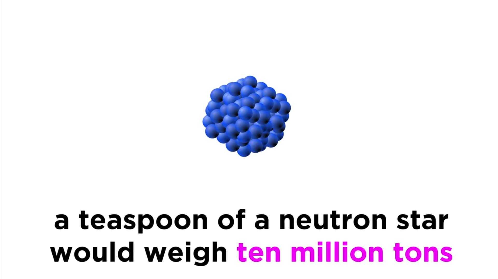

A teaspoon of a neutron star would weigh a whopping ten million tons! But even more miraculously, **if the core of the star is above around three solar masses, even the outward pressure of neutrons pressing right up against each other, or neutron degeneracy pressure, is not enough to stop the immense gravity**, and the neutrons will be crushed together as the remaining mass collapses into a single point of infinite density.The entire mass of the star’s core, contained within zero volume. This object is called a **black hole.**

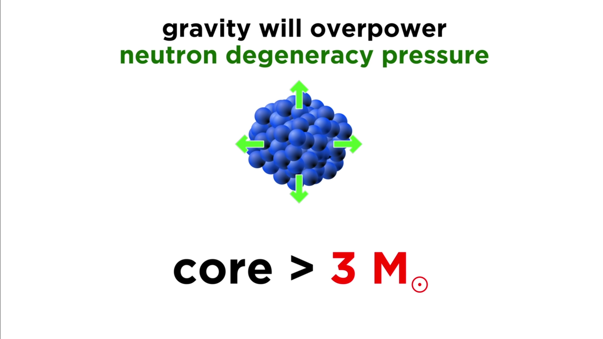

### Blackhole

**If the core of the star is above around three solar masses, even the outward pressure of neutrons pressing right up against each other, or neutron degeneracy pressure, is not enough to stop the immense gravity**, and the neutrons will be crushed together as the remaining mass collapses into a single point of infinite density.The entire mass of the star’s core, contained within zero volume. This object is called a **black hole.**

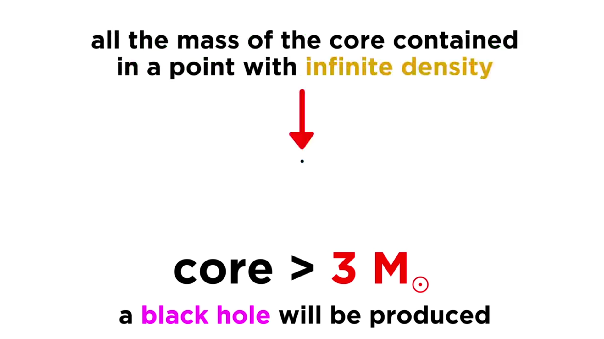

The outer layers of the star that have been ejected, full of heavy nuclei fused during the lifetime of the star, and the additional even heavier ones formed during the supernova, will leave behind a colorful nebula. But the singularity that is left behind is anything but colorful.

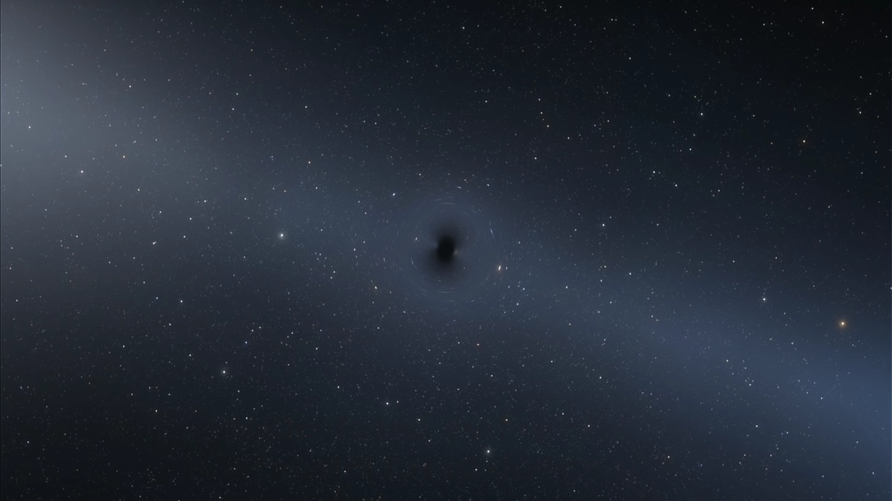

A black hole, given its infinite density, warps spacetime so much that not even light can escape. Whatever a black hole might look like, if that can even mean anything, we will probably never find out, because it is impossible for photons to leave it and reach our eyes, which is how we see things.

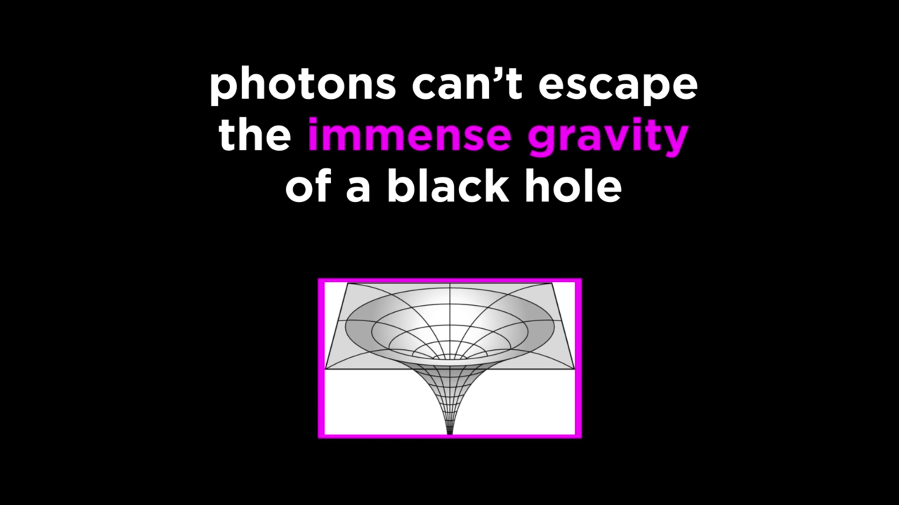

As incredible as this may sound, this is how nature works, and black holes do indeed exist all over the universe, as the remnants of huge dead stars. Black holes are so fascinating that they will require a whole new post unto themselves, which I will get to in a next blog post.

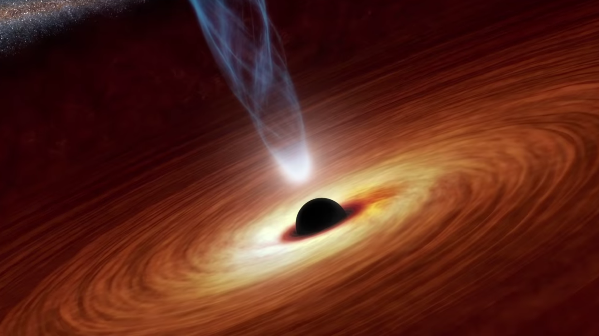

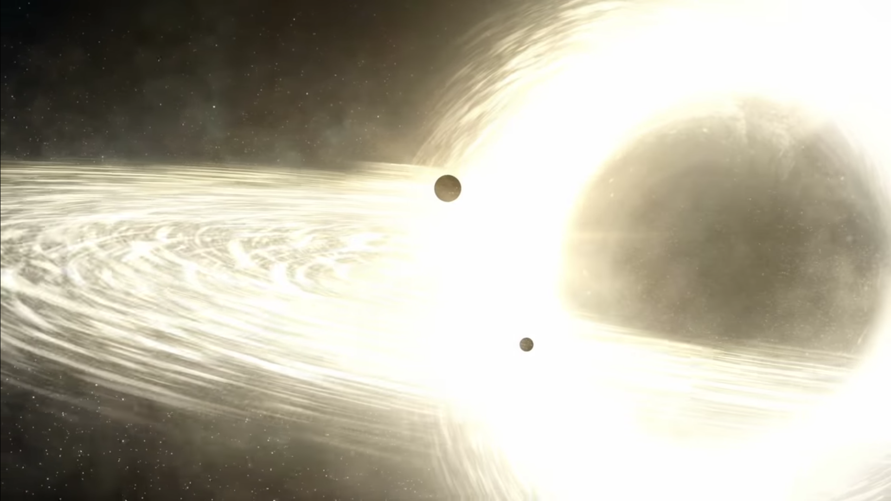

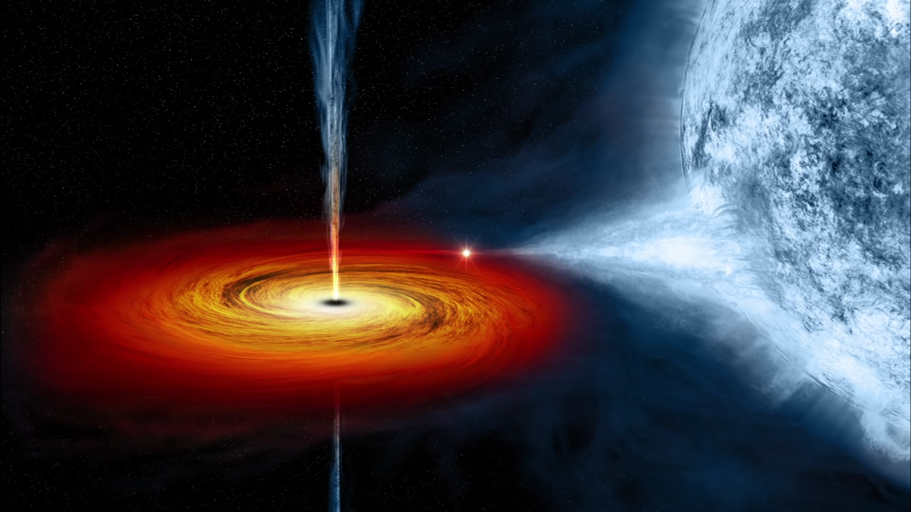

## Review

For now, let’s review what we just learned about the lifetime of a star. When a star forms from a gas cloud of some mass, which is almost always between a tenth of a solar mass and around thirty solar masses, a star is produced somewhere along the main sequence. As the fuel in the core begins to run out, it contracts, which raises the pressure around the core and pushes the outer layers outward, where they will then cool, producing a red giant.So all stars will have a red giant phase when their fuel is almost gone, regardless of their mass.

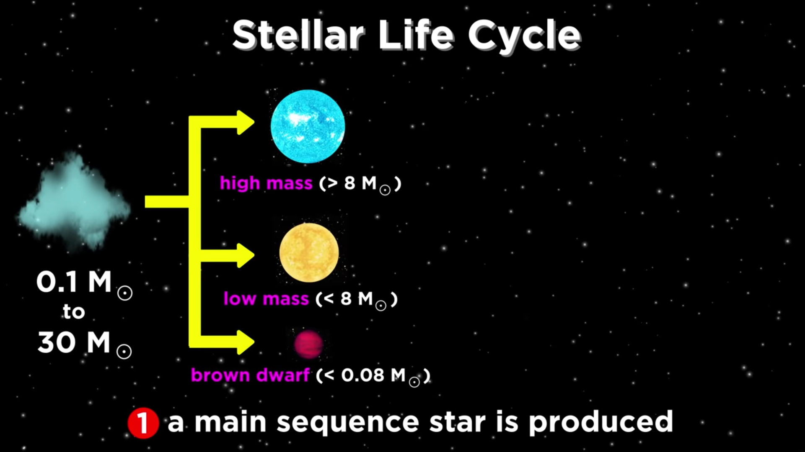

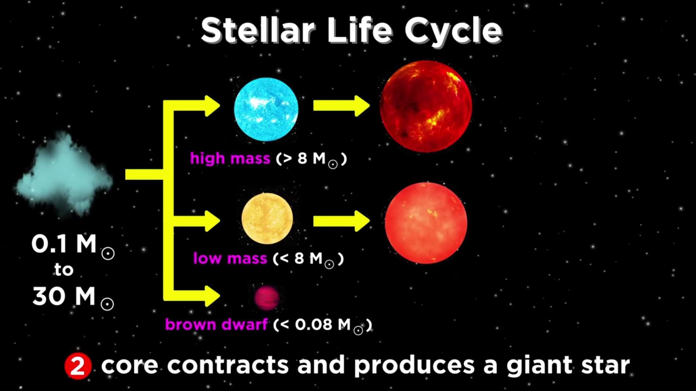

Then finally, when the star can no longer perform sufficient nuclear fusion so as to counter the effects of gravity, the star will collapse, leaving a white dwarf if it is of low mass, a neutron star if it is of intermediate mass, and a black hole if it is of especially high mass.

As we mentioned, black holes are among the most fascinating objects in the universe, and they are a popular area of study amongst astronomers and theoretical physics alike, because there is so much that we still don’t understand about these strange creatures. Let’s move forward and learn a little more about black holes in the next post.
