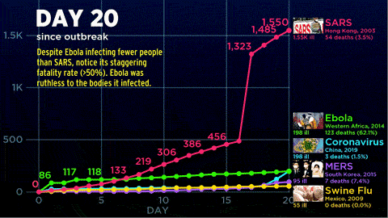
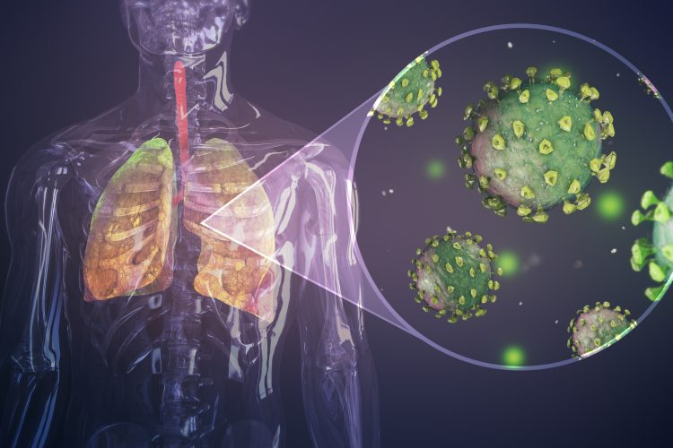
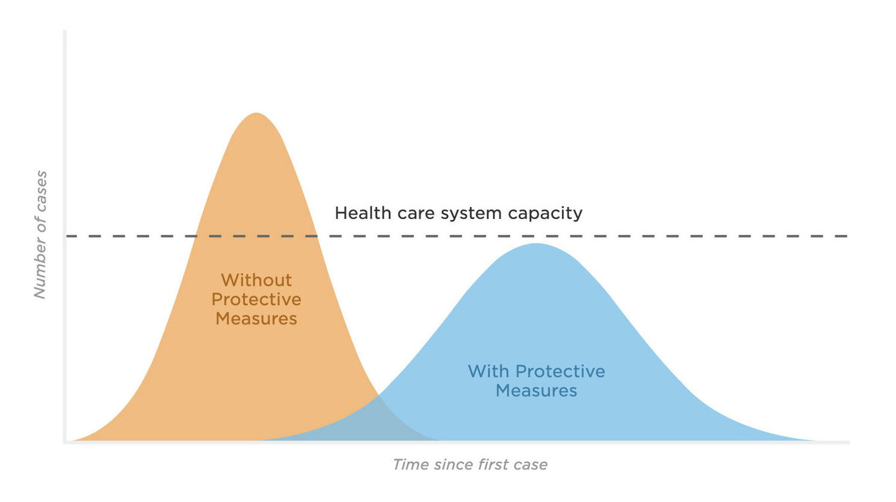

<!--StartFragment-->

# What actually happens when it infects a human and what should we all do?

A virus is really just a hull around genetic material and a few proteins, arguably not even a living thing. It can only make more of itself by entering a living cell. Corona may spread via surfaces, but it's still uncertain how long it can survive on them. Its main way of spreading seems to be droplet infection when people *cough*, or *if you touch someone who's ill* and then your face, say rubbing your eyes or nose. And this simple reason made it a pandemic.

The virus starts its journey here and then hitches a ride as a stowaway deeper into the body. Its destinations are "the intestines", "the spleen" or "the lungs", where it can have the most dramatic effect. 

> Even just a few coronaviruses can cause quite a dramatic situation.

## Process of Infection

The lungs are lined with billions of epithelial cells. These are the border cells of your body, lining your organs and mucosa waiting to be infected. Corona connects to a specific receptor on its victim's membranes to inject its genetic material into a cell.

The cell, ignorant of what's happening, executes the new instructions as always, which are pretty simple: "copy and reassemble". It fills up with more and more copies of the original virus until it reaches a critical point and due to large number of foreign infiltration it receives one final order, "self-destruct". The cell sort of melts away, releasing new corona particles ready to attack more cells. 

The number of infected cells grows exponentially After about 10 days, millions of body cells are infected, and billions of viruses swarmed the lungs.

### The real problem starts now, confusion within our immune system

The virus has not caused too much damage yet, but the corona is now going to release a real beast on you, your own immune system. The immune system, while there to protect you, can actually be pretty dangerous to yourself and needs tight regulation. And as immune cells pour into the lungs to fight the virus, Corona infects some of them and creates confusion.

Cells have neither ears nor eyes. They communicate mostly via tiny information proteins called cytokines. Nearly every important immune reaction is controlled by them. Corona causes infected immune cells to overreact and yell bloody murder. This is due to a lot of infection in lungs which was never experienced by your body. In a sense, it puts the immune system into a fighting frenzy and sends way more soldiers than it should, wasting its resources and causing damage. 

Among these immune soldiers, Two kinds of cells in particular wreak havoc. First, "Neutrophils", which are great at killing stuff, including our cells. As they arrive in their thousands, they start pumping out enzymes that destroy as many friends as enemies. The other important type of cells that go into a frenzy are "Killer T-cells", which usually order infected cells to commit controlled suicide. Confused as they are, they start ordering healthy cells to kill themselves too. The more and more immune cells arrive the more damage they do and the more healthy lung tissue they kill. This might get so bad that it can cause permanent irreversible damage, that leads to lifelong disabilities.

`A slight relief that our doctors can rely:` In most cases, the immune system slowly regains control. It kills the infected cells, intercepts the viruses trying to infect new ones and cleans up the battlefield. "Recovery begins".

### Why is COVID19 Deadly if we can recover our self 

The majority of people infected by Corona will get through it with relatively mild symptoms. But many cases become severe or even critical. We don't know the percentage because not all cases have been identified, but it's safe to say that there is a lot more than with the flu. In more severe cases, Millions of "epithelial cells" have died and with them, the lungs' protective lining is gone. That means that the "Alveoli - tiny air sacs via which breathing occurs"- can be infected by bacteria that aren't usually a big problem. Patients get "Pneumonia". Respiration becomes hard or even fails, and patients need "Ventilators" to survive. 

> The immune system has fought at full capacity for weeks and made millions of antiviral weapons. And as thousands of bacteria rapidly multiply, it is overwhelmed. They enter the blood and overrun the body; if this happens, death is very likely. 

## The future of a pandemic like Corona

Coronavirus is often compared to the flu, but actually, it's much more dangerous. While the exact death rate is hard to pin down during an ongoing pandemic, we know for sure that it's much more contagious and spreads faster than the flu. There are two futures for a pandemic like Corona: One, "fast" and other was "slow".

Which future we will see depends on how we all react to it in the early days of the outbreak.

A fast pandemic will be horrible and cost many lives; a slow pandemic will not be remembered by the history books. The worst-case scenario for a fast pandemic begins with a very rapid rate of infection because there are no countermeasures in place to slow it down.

### Why is a fast pandemic so bad?

* fast pandemic - Will not have any protective measures.
* Slow pandemic - Everyone will be covered under health care.

In a fast pandemic, many people get sick at the same time. If the numbers get too large, health care systems become unable to handle it. There aren't enough resources, like medical staff or equipment like ventilators, left to help everybody. People will die untreated. And as more health care workers get sick themselves, the capacity of health care systems falls even further. If this becomes the case, then horrible decisions will have to be made about who gets to live and who doesn't. The number of deaths rises significantly in such a scenario. 

To avoid this, the world - that means all of us - needs to do what it can to turn this into a **"Slow pandemic"**. A pandemic is slowed down by the right responses. Especially in the early phase, so that everyone who gets sick can get treatment and there's no crunch point with overwhelmed hospitals. Since we don't have a vaccine for Corona, we have to socially engineer our behavior, to act as a social vaccine. This simply means two things:

1. Not getting infected and
2. Not infecting others.

## A way to destroy corona

Although it sounds trivial, the very best thing you can do is to **"wash your hands"**. The soap is actually a powerful tool. The coronavirus is encased in what is basically a layer of fat; soap breaks that fat apart and leaves it unable to infect you. It also makes your hands slippery, and with the mechanical motions of washing, viruses are ripped away. To do it properly, wash your hands as if you've just cut up some jalapeños and want to put in your contact lenses next.

The next thing is **"Social Distancing"**, which is not a nice experience, but a nice thing to do. This means no hugging, no handshakes. If you can stay at home, stay at home to protect those who need to be out for society to function: from doctors to cashiers, or police officers; You depend on all of them; they all depend on you to not get sick.

## My perspective towards this Pandemic and to the Prevention measures of our government

On a larger level, there are quarantines, which can mean different things, from travel restrictions or actual orders to stay at home. Quarantines are not great to experience and certainly not popular. But they buy us - and especially the researchers working on medication and vaccinations - a crucial time

So if you are put under quarantine, you should understand why, and respect it. None of this is fun. But looking at the big picture, it is a really small price to pay. The question of how pandemics end depends on how they start; if they start fast with a steep slope, they end badly. If they start slow, with a not-so-steep slope, they end okay-ish. And, in this day and age, it really is in all of our hands. If we understand this there is no need for the government to take harsh policies and actions.

<!--EndFragment-->
