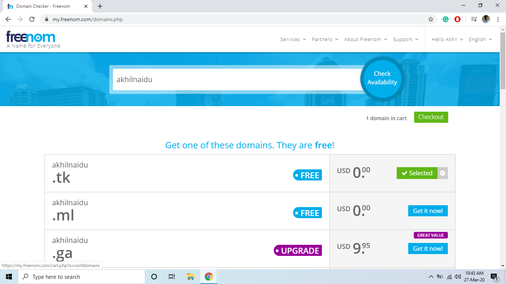
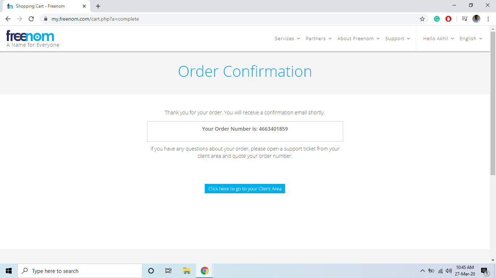
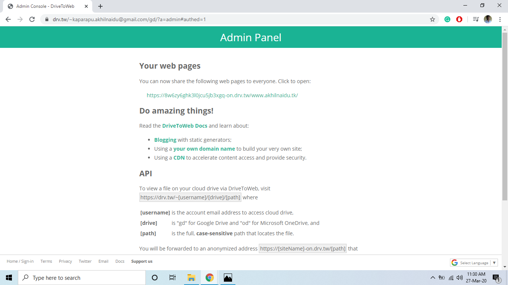
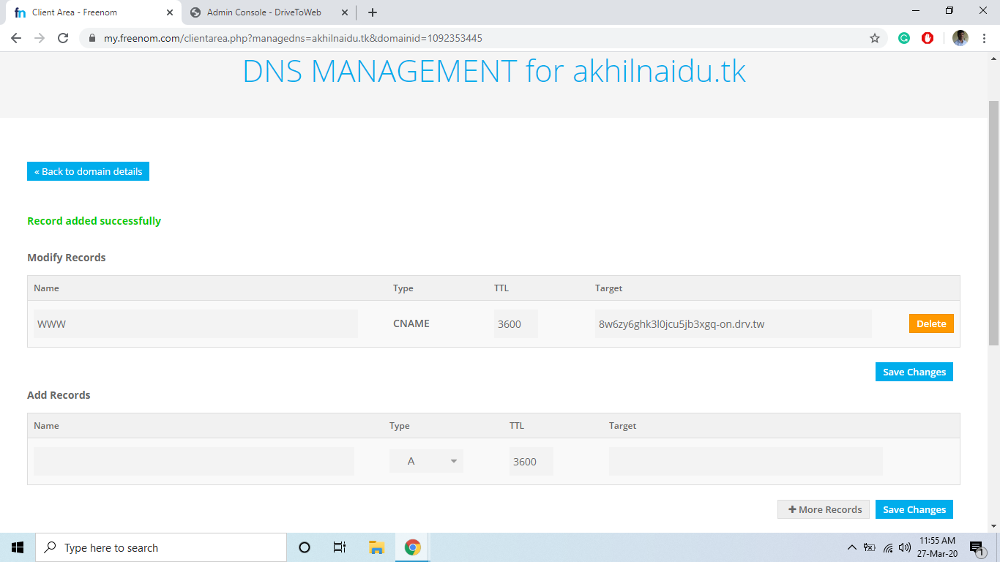

<!--StartFragment-->

Did you know that you can use Google Drive to host a variety of different websites varying from basic websites to even complex javascript we apps? If not, let take advantage of Google Drive’s free storage to upload and publish any kind of static content to host a website or host your personal collections online.

At the end of this blog, you will be able to create your own domain name and host your website in it for free.

* <https://8w6zy6ghk3l0jcu5jb3xgq-on.drv.tw/www.akhilnaidu.tk/>
* .<http://www.akhilnaidu.tk> (After configuring your domain using Freenom)

## Small information for better understating of this.

A simple definition of “hosting” for people who are new to this. Hosting means storing files/software in a place where everyone can access it. Those files can vary from simple code to complex algorithms or even a collection of pictures. As you already know Google is also proving us an option to store or share files personally and publicly, which in a way has the capability of hosting a website.

### Advantages

* It's totally free
* No bandwidth limits and always up
* No FTP software required
* Replacing files in G Drive will update your website

### Disadvantages

* If you want to replace your previous website which is from WordPress or Joomla or any PHP based websites, this will not work for you.
* This is only for static websites, ie, content remains constant

### How can use it at your advantage

* Personal blog/ website for free of cost
* Your online resume
* A simple collection of data, for your future self.

There are many other wide varieties of ways you can use it, but the purpose was the same in all. You are making yourself a place in the Online community, having an account in Facebook and Instagram is not defined as being online, it is being socially online.

### Things required for a decent website/blog

I don’t want to leave you halfway with a feel of in-completion. At the end of this article, if you gain some interest and have time to work, you should be capable of doing a lot more than just what I taught. For you to be in a position to work alone without any difficulties there should be a decent number of tools to use and concepts to be clear in the head. Here, I’m introducing you to some of them.

1. Some files to host online(Hello world blog post)
2. Drive to Web (In a way converting GDrive to Github)
3. Name for your website for free of cost (Freenom, Github Domain)

## Step-01: Registering a Domain name using Freenom

Let’s start by choosing and creating a name for our website. I would like to use my name, "akhilnaidu", as the name for my blog in this guide.

1. Create an account in Freenom, preferable use google to signup
2. Now in the top menu, go to **Service > Register New Domain**
3. Check availability of the name, for this article I’m using my name, “**akhilnaidu**”
4. Select one free domain and proceed to checkout
5. Chane the period to **12months@Free** and leave the rest.
6. Check the terms and conditions and complete Order



In most cases, the order completion  will be done instantaneously, so go to your client area and check it, if not it will done in a few minutes, In the meanwhile let’s proceed to the next step



## Step-02: Hello world HTML document in GDrive

1. Create a folder with your domain name starting with “www” and add your domain name as tail, ex:”**www.akhilnaidu.tk**”
2. Make this folder shareable to public
3. Create a blank HTML file, in it.
4. Copy this, for demo post, you can change this later.

```html
<html>
<header>
    <title>Demo Title: Naidu's Blog</title>
</header>

    
    <br><br><br>
    This is how you start writing your first post, you can use all the html features

</html>
```

## Step-03: Configuring Drive to Web

1. Open this link, <https://drv.tw> or [click here](https://drv.tw)
2. Select google drive
3. Sign in with the email associated with the google drive where you uploaded the website files
4. Click allow and if asking for any permissions, give it.
5. Now your website is hosted in google drive for free, and you will receive the new URL



## Step-04: Using your domain as URL

1. Copy the above URL provided in the admin panel of Drive to Web without the text that comes after the drv.tw and without https and go to Freenom client area

   ex:  Drive to Web URL: https://8w6zy6ghk3l0jcu5jb3xgq-on.drv.tw/www.akhilnaidu.tk\
   Required URL: **8w6zy6ghk3l0jcu5jb3xgq-on.drv.tw**
2. Go to your domain, "akhilnaidu.tk ", and press manage domain
3. Select, “Manage Freenom DNS”
4. Create a new record with 

   Name: WWW\
   Type: CNAME\
   TTL: 3600\
   Target: Copied URL, ex: 8w6zy6ghk3l0jcu5jb3xgq-on.drv.tw
5. Target URL should end with drv.tw and should not contain https



## Next is all up-to you

The record should take upto 30 minutes to get acceoted globally. You can track the progress of propagation with the help of these tools.

* whatsmydns.net, a proxy tool which bypasses DNS and Local cache
* Kproxy, anothey proxy server

Congratulations!! Your website is now online with no hosting cost. The cost you have to pay is attention towards this blog, some spare time and interest to do something useful and some space in google drive.

Check the website I created while writing this blog: 

* <http://www.akhilnaidu.tk>
* <https://8w6zy6ghk3l0jcu5jb3xgq-on.drv.tw/www.akhilnaidu.tk/>

Now by replacing the index.html file with your desired html file, like your CV or Blog Post you can have your own personal portfolio or you can create your own personal website if you use some HTML Templates

<!--EndFragment-->